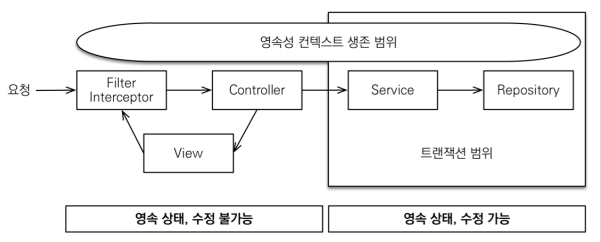
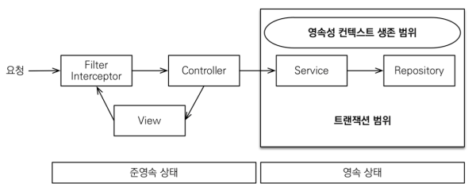

### 도메인 모델 패턴
- 엔티티에 비지니스 로직을 몰아넣고 서비스에서 호출하는 방식
- 서비스 계층은 엔티티에 비지니스 로직을 위임

### 트렌젝션 스크립트 패턴
- 반대로 엔티티에선 비지니스 로직이 거의 업속 서비스에서 대부부 로직을 처리하는 패턴

---
### 변경감지와 병합(merge)
1. 준영속 엔티티?
- 영속성 컨텍스트가 더이상 관리하지 않는 엔티티
- 임의로 만들어낸 엔티티도 기존 식별자를 가지고 있으면 준영속 엔티티로 볼 수 있다.

2. 준영속 엔티티를 수정하는 2가지 방법
- 변경 감지 기능 사용
- 병합(merge) 사용

3. 병합 사용 시 주의해야할 점 
- 변경 감지 기능을 사용하면 원하는 속성만 변경이 가능하지만, 병합을 사용하면 모든 속성이 변경된다.  
병합시 값이 없으면 null로 업데이트 할 위험이 있다.(병합은 모든 필드를 교체한다.)

4. 결론
- 가급적 merge를 사용하지 않고 변경감지를 사용하는 것으로 개념을 잡으면 혹시 발생할 위험을 방지 가능

### OSIV(Open Session In View: 하이버네이트)
- Open Session In view: 하이버네이트
  * 예전 하이버네이트에서는 EntityManager가 Session. 
- Open EntityManager In View : JPA

1. OSIV true 인 경우
   - Transaction이 끝나도 데이터베이스 커넥션을 유지한다. http 응답을 해서 종료할 때까지 유지.  
   그런데 이 전략은 너무 오랜시간 동안 데이터베이스 커넥션을 사용하기 때문에 실시간 트레픽이 중요한 시스템에서는 커넥션이 모자랄 수 있다.  
   이것은 결국 장애로 이어진다.  
   예를 들어 외부 API를 호출하면 외부 API 대기 시간만큼 커넥션 리소스를 유지한다.
   
   
2. OSIV OFF 인 경우
   - Transaction을 종료할 때 영속성 컨텍스트를 닫고 데이터베이스 커넥션을 반환한다.  
     OSIV를 끄면 모든 지연로딩을 트랜잭션 안에서 처리해야 한다. 따라서 지금까지 작성한 많은 지연로딩 코드를 트랜잭션 안으로 넣어야 하는 단점이 있다.
   

3. 커멘드와 쿼리 분리
    - 보통 비지니스 로직은 특정 엔티티 몇 개를 등록하거나 수정하는 것이므로 성능에 크게 문제가 되지 않는다.
    - 그런데 복잡한 화면을 출력하기 위한 쿼리는 화면에 맞추어 성능을 최적화 하는 것이 중요하다. 그 복잡성에 비해 핵심 비지니스에 큰 영향을 주는 것은 아니다.
    - 그래서 복잡한 어플리케이션일 수록 이 둘의 관심사를 명확하게 분리하는 선택은 유지보수 관점에서 충분히 의미가 있다.
    - ex) Order Service
        - OrderService: 핵심 비지니스 로직
        - OrderQueryService: 화면이나 API에 맞춘 서비스(주로 읽기 전용 트랜잭션 사용)
    - 고객 서비스의 실시간 API는 OSIV를 끄고, admin 처럼 커넥션을 많이 사용하지 않는 곳에서는 OSIV를 켠다.